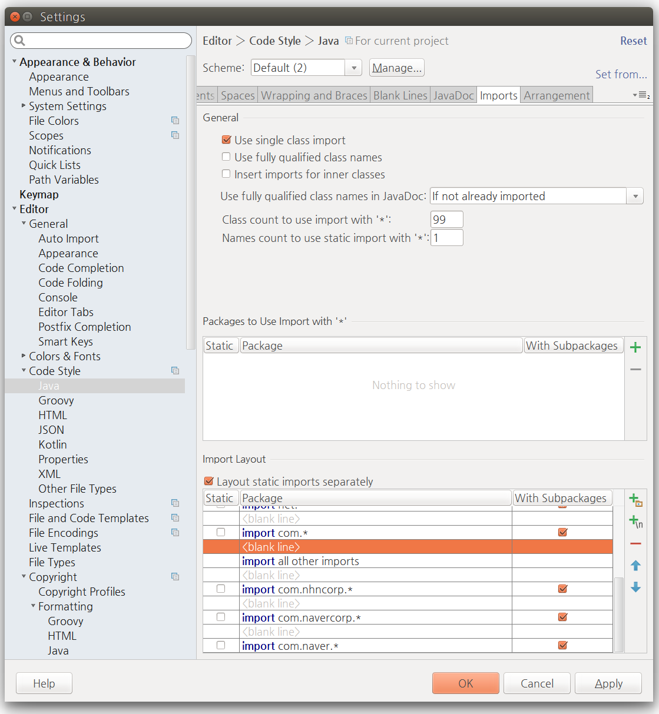
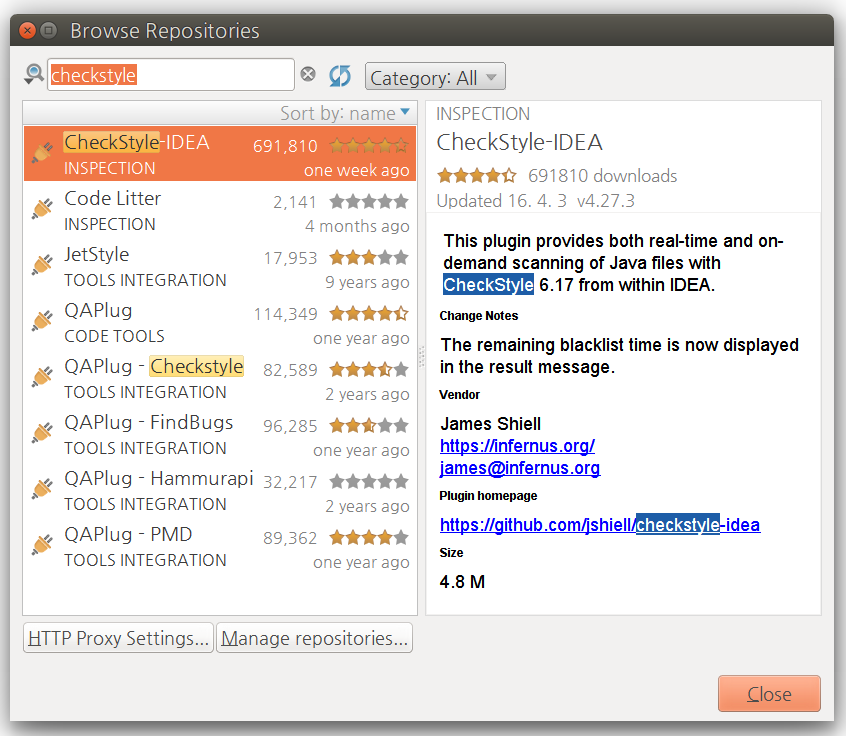
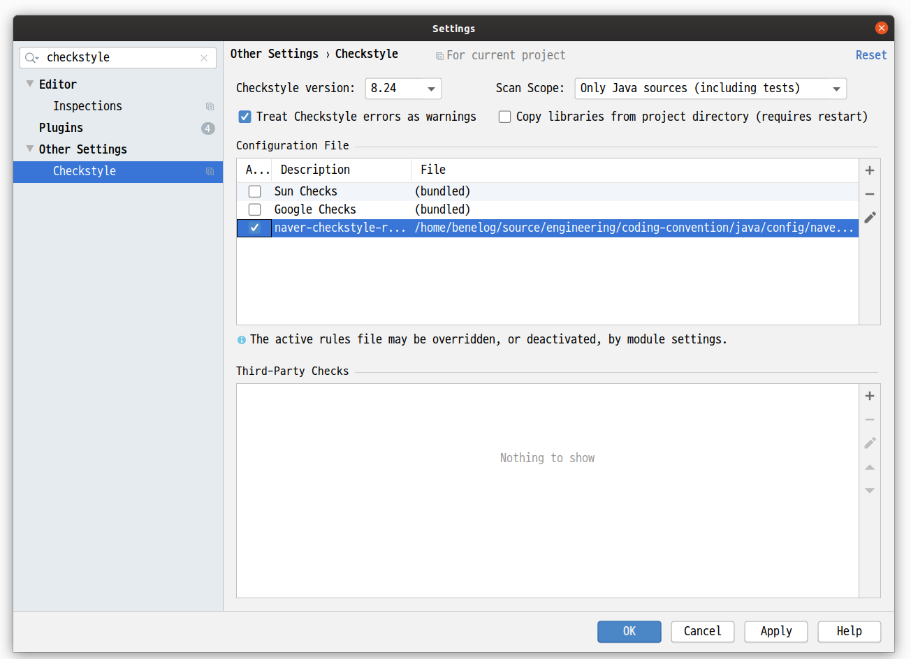

include::./tool-variables.adoc[]

[appendix]
[[editorconfig]]
== .editorconfig 파일 설정
`.editorconfig` 는 다양한 에디터와 IDE에서 공통적으로 지원하는 코드 스타일에 대한 설정 파일이다.
자세한 스펙은 https://editorconfig.org/ 에서 파악할 수 있다.
다양한 에디터로 파일을 고칠 때 같은 규칙을 참조할수 있도록 가급적 이 파일을 소스 저장소에서 올려서 공유하는 것을 권장한다.

[source,properties]
.`.editconfig`의 예제
----
# top-most EditorConfig file
root = true

[*]
# [encoding-utf8]
charset = utf-8

# [newline-lf]
end_of_line = lf

# [newline-eof]
insert_final_newline = true

[*.bat]
end_of_line = crlf

[*.java]
# [indentation-tab]
indent_style = tab

# [4-spaces-tab]
indent_size = 4
tab_width = 4

# [no-trailing-spaces]
trim_trailing_whitespace = true

[line-length-120]
max_line_length = 120

----

[appendix]
[[checkstyle]]
== Checkstyle 사용법
Checkstyle 은 코딩컨벤션 검사 도구이다. 이 가이드에서 안내하는 규칙을 검사하는 checkstyle  규칙 설정 파일을 제공한다.

[[checkstyle-version]]
=== 필수 버전
Checkstyle {checkstyle-version} 버전 이상을 사용해야 한다. 빌드 도구와 IDE에서 권장한 버전을 쓰고 있는지 확인을 한다.

[[checkstyle-rule-download]]
=== 규칙 설정 파일 다운로드
{checkstyle-rules} 에서 다운로드한다.

[[checkstyle-rule-execution]]
=== 검사 실행
실제 프로젝트에서 쓸 때는 IDE나 빌드도구와 연동해서 사용하는것을 권장한다. 그러나 규칙 파일을 커스터마이징 했을 때에는 Checkstyle을 독립적으로 실행을 해서 IDE나 빌드스크립트와 연동하기 전에 먼저 테스트해 보기를 권장한다.

독립적으로 실행할 때는
https://github.com/checkstyle/checkstyle/releases/ 에서 jar 파일을 다운로드하고 아래와 같이 실행한다.

[source,subs="attributes+"]
.checkstyle 독립실행
----
java -jar checkstyle-{checkstyle-version}-all.jar -c [규칙파일] [소스폴더]
----

{checkstyle-rules}[naver-checkstyle-rules.xml]을 수정 없이 사용할 때는  `-DsuppressionFile` 속성을 지정해야 한다.
예외선언 파일의 위치를 IDE와 Maven/Gradle 빌드 양쪽에서 참조하기 위해서 필요한 속성이다.

.naver-checkstyle-rules.xml 독립 실행 사례
[source,subs="attributes+"]]
----
java -DsuppressionFile=naver-checkstyle-suppressions.xml -jar checkstyle-{checkstyle-version}-all.jar -c naver-checkstyle-rules.xml src
----

만약 검사 대상에서 제외할 파일이 없다면 <<checkstyle-rule-suppressions-xml>> 을 참조해서 `suppressionFile` 과 관련된 선언을 삭제하고 위의 명령에서도 생략할 수 있다.

[[checkstyle-rule-finding]]
=== 관련 규칙 확인 방법
규칙 파일에서는 규칙의 ID를 주석으로 달았다. 경고 메시지에서도 규칙의 ID를 표시한다.

[source,xml]
----
<!-- [1-line-package-import]-->
<module name="NoLineWrap">
    <property name="tokens" value="PACKAGE_DEF, IMPORT"/>
        <message key="no.line.wrap"
            value="[1-line-package-import] {0} statement should not be line-wrapped."/>
</module>
----

규칙의 ID를 이 가이드에서 검색해서 해당 규칙을 찾는다. HTML문서에서는 #뒤에 규칙의 ID를 붙여서 바로 이동할 수도 있다. 예를 들면 [need-brace]에 규칙에 대한 설명은 http://docs.navercorp.com/coding-convention/java.html#need-braces 링크를 걸 수 있다. 온라인 코드 리뷰를 할 때도 이런 링크를 활용할 수 있다.

[[checkstyle-rule-limitation]]
=== 검사할 수 없는 규칙
아래 규칙은 Checkstyle로 검사할 수 없다.

* <<avoid-korean-pronounce>>
* <<class-noun>>
* <<interface-noun-adj>>
* <<method-verb-preposition>>
* <<test-class-suffix>>
* <<space-after-bracket>>
* <<space-around-comment>>

[[checkstyle-rule-suppressions]]
=== 검사 대상에서 제외하기

[[checkstyle-rule-suppressions-xml]]
====  제외 대상을 별도의 파일로 선언
Checkstyle에서는 검사대상에서 제외할 파일을 별도의 설정파일에서 지정할 수 있다.

{checkstyle-rules}[naver-checkstyle-rules.xml]의 설정에서는 `suppressionFile` 이라는 속성으로 `naver-checkstyle-suppressions.xml` 파일의 위치를 지정할 수 있도록 미리 설정되어 있다.

[source,xml]
----
    <module name="SuppressionFilter">
        <property name="file" value="${suppressionFile}"/>
        <property name="optional" value="false"/>
    </module>
----

굳이 예외로 지정할 파일이 없다면 {checkstyle-rules}[naver-checkstyle-rules.xml]에서 위의 선언은 삭제하고 사용한다.

`suppressionFile` 속성으로 참조할 파일은 `naver-checkstyle-suppressions.xml` 과 같은 이름으로 지정한다.

[source,xml]
.naver-checkstyle-suppressions.xml 선언의 예
----
<?xml version="1.0"?>
<!DOCTYPE suppressions PUBLIC
"-//Puppy Crawl//DTD Suppressions 1.1//EN"
"http://www.puppycrawl.com/dtds/suppressions_1_1.dtd">

<suppressions>
    <suppress files="UserController.java" checks=".*"/>
    <suppress files="UserService.java" checks=".*"/>
</suppressions>
----

파일명을 정규식으로 설정하는 것도 가능하다. 자세한 선언 방법은 http://checkstyle.sourceforge.net/config_filters.html#SuppressionFilter 을 참조한다.

[[checkstyle-rule-suppressions-source]]
==== 제외할 영역을 주석으로 표시
{checkstyle-rules}[naver-checkstyle-rules.xml] 의 설정에서는 아래와 같은 주석문을 인식한다.

* `// @checkstyle:off` : 다음 행부터 검사 대상에서 제외
* `// @checkstyle:on` : 다음 행부터 검사 대상에 포함
* `// @checkstyle:ignore` // 같은 행의 소스를 검사하지 않음

[source,java]
.검사 대상에서 제외하는 주석 사용 예
----
public class MyCAO { // @checkstyle:ignore 외부에 배포된 라이브러리
    public static final String SYSTEM_ID = "MD23D2";
    // @checkstyle:off
    public String CONNECT_URL;
    public String USER_ID;
    // @checkstyle:on
}
----

[[checkstyle-customizing]]
=== 커스터마이징
`naver-checkstyle-rules.xml`에 정의된 규칙을 프로젝트에서 더 추가하거나, 수정해서 쓰려고 할 때 참고할만한 정보를 정리한다.

[[checkstyle-customizing-abbr-list]]
==== 대문자로 표기할 약어를 추가
'<<list-uppercase-abbr>>' 규칙에 따라서 대문자로 표기할 약어는 따로 명시해야 한다. `naver-checkstyle-rules.xml` 파일에서 `allowedAbbreviations` 속성에 해당 단어를 추가한다.

[source,xml]
.대문자로 표기할 약어를 설정 파일에 명시
----
<!-- [list-uppercase-abbr] -->
<module name="AbbreviationAsWordInName">
    <property name="ignoreFinal" value="false"/>
    <property name="allowedAbbreviationLength" value="1"/>
    <message key="abbreviation.as.word"
    value="[list-uppercase-abbr] Abbreviation in name ''{0}'' must contain no more than {1}"/>
    <property name="allowedAbbreviations" value="DAO,BO"/>
</module>
----

설정 파일을 고치지 않으려면 `@checkstyle:ignore`와 같은 주석을 이용할 수도 있다.

[[checkstyle-customizing-indent]]
==== 들여쓰기에 탭 대신 스페이스 사용
아래 선언을  `naver-checkstyle-rules.xml` 에서 삭제한다.

[source,xml]
.탭문자로 들여쓰도록 검사하는 규칙 선언
----
<!-- [indentation-tab] -->
<module name="RegexpSinglelineJava">
    <property name="format" value="^\t* "/>
    <property name="message" value="[indentation-tab] Indent must use tab characters"/>
    <property name="ignoreComments" value="true"/>
</module>
----

대신 아래와 같이 탭문자가 포함되어 있을때 경고를 보내는 선언을 추가한다.

[source,xml]
.스페이스로 들여쓰도록 검사하는 규칙 선언
----
<module name="FileTabCharacter">
    <property name="eachLine" value="true"/>
</module>
----

[appendix]
== 빌드 도구 설정
=== Maven
`pom.xml`에서 아래와 같은 선언을 추가한다.

[[maven-encoding]]
==== 인코딩 지정
`pom.xml`의 `<project/>` 태그의 하위 요소로 아래와 같이 소스 파일의 인코딩을 `UTF-8` 로 명시한다.

[source,xml]
----
<properties>
    <project.build.sourceEncoding>UTF-8</project.build.sourceEncoding>
</properties>
----

위의 속성값들은 `maven-compiler-plugin` 과 `maven-resources-plugin` 에서 기본값으로 참조된다.
`<plugins/>` 선언부에서 직접 encoding을 명시하고 있다면 위의 속성이 참조되지 않는다.
아래와 같은 경우이다.

[source,xml]
.Maven의 플러그인별 설정에서 인코딩 지정
----
<plugin>
    <groupId>org.apache.maven.plugins</groupId>
    <artifactId>maven-compiler-plugin</artifactId>
    <version>3.1</version>
    <configuration>
        <source>1.8</source>
        <target>1.8</target>
        <encoding>UTF-8</encoding>
    </configuration>
</plugin>
<plugin>
    <groupId>org.apache.maven.plugins</groupId>
    <artifactId>maven-resources-plugin</artifactId>
    <version>2.7</version>
    <configuration>
        <encoding>UTF-8</encoding>
    </configuration>
</plugin>
----

[[maven-editorconfig]]
==== editorconfig 플러그인 설정
https://github.com/ec4j/editorconfig-maven-plugin 을 참고한다.

[[maven-checkstyle]]
==== Checkstyle 플러그인 설정
`<build>` 태그 아래에 `<pluginManagement/>` 선언에 maven-checkstyle-plugin의 버전과 checkstyle의 버전을 명시한다.
checkstyle의 버전은 반드시 {checkstyle-version} 이상으로 지정한다.

예외를 선언할 파일이 없다면 `naver-checkstyle-suppressions.xml` 과 관련된 설정은 생략해도 된다.

[source,xml,subs="attributes+"]
.pluginManagement 선언
----
<pluginManagement>
    <plugins>
        <plugin>
            <groupId>org.apache.maven.plugins</groupId>
            <artifactId>maven-checkstyle-plugin</artifactId>
            <version>3.1.0</version>
            <configuration>
                <configLocation>naver-checkstyle-rules.xml</configLocation>
                <sourceDirectory>${project.build.sourceDirectories}</sourceDirectory>
                <propertyExpansion>suppressionFile=./naver-checkstyle-suppressions.xml</propertyExpansion>
            </configuration>
            <dependencies>
                <dependency>
                    <groupId>com.puppycrawl.tools</groupId>
                    <artifactId>checkstyle</artifactId>
                    <version>{checkstyle-version}</version>
                </dependency>
            </dependencies>
        </plugin>
    </plugins>
</pluginManagement>
----

`<build>` -> `<plugins>` 태그 아래에 다음과 같은 선언을 추가한다.

[source,xml]
.plugin 선언
----
<plugin>
    <groupId>org.apache.maven.plugins</groupId>
    <artifactId>maven-checkstyle-plugin</artifactId>
</plugin>
----

`mvn checkstyle:checkstyle`로 실행하면 검사가 시작된다. `mvn site` 명령으로 검사를 실행하고 싶다면 `<reporting>` -> `<plugins>`태그 아래에 위의 선언을 추가한다.

=== Gradle
Gradle 버전 5.4.1 이상을 권장한다.

[[gradle-encoding]]
==== 인코딩 지정
Java plugin의 속성으로 인코딩을 지정한다. 아래와 같이 여러 방법이 가능하다.

[source,groovy]
.java plugin의 속성에서 인코딩을 지정
----
plugins {
    id 'java'
}

...

// 방법1
compileJava.options.encoding = 'UTF-8'
compileTestJava.options.encoding = 'UTF-8'

// 방법 2
[compileJava, compileTestJava]*.options*.encoding = 'UTF-8'

// 방법 3
tasks.withType(Compile) {
    options.encoding = 'UTF-8'
}
----

[[gradle-editorconfig]]

==== .editorconfig 플러그인 설정
https://github.com/ec4j/editorconfig-gradle-plugin[editorconfig-gradle-plugin]을 설정하면 `.editorconfig` 의 선언과 어긋나는 파일이 존재하면 빌드를 실패하게 만들수 있다.
아래와 같이 `build.gradle`에 선언한다.

[source,groovy,subs="attributes+"]
----
plugins {
    id 'org.ec4j.editorconfig' version '0.0.3'

}
editorconfig {
    excludes = ['build']
}

check.dependsOn editorconfigCheck
----

[[gradle-checkstyle]]
==== Checkstyle 플러그인 설정
아래와 같이 `build.gradle`에 선언한다.

[source,groovy,subs="attributes+"]
----
plugins {
    id 'checkstyle'
}

checkstyle {
    maxWarnings = 0 // 규칙이 어긋나는 코드가 하나라도 있을 경우 빌드 fail을 내고 싶다면 이 선언을 추가한다.
    configFile = file("${rootDir}/naver-chestyle-rules.xml")
    configProperties = ["suppressionFile" : "${rootDir}/naver-checkstyle-suppressions.xml"]
    toolVersion ="{checkstyle-version}"  // checkstyle 버전 {checkstyle-version} 이상 선언
}
----

예외를 선언할 파일이 없다면 `naver-style-supressions.xml` 관련 선언은 생략할 수 있다.

[appendix]
[[editor-config]]
== 편집기 설정
이 가이드의 규칙을 지키는데 도움이 되는 코드 편집기와 뷰어 설정 방법을 정리한다.

=== Eclipse

[[eclipse-imports]]
==== `Organize Imports` 설정
아래 규칙을 자동으로 지키도록 해준다.

* <<avoid-star-import>>
* <<import-grouping>>

아래와 같은 순서로 설정한다.

1. importorder 설정 파일 다운로드
** `naver.importorder` 파일을 {eclipse-import-order} 에서 다운로드한다.
2. `Organize Imports` 설정 화면으로 이동
** Workspace 전역설정은 `Window > Preference > Java > Code style > Organize Imports`로 이동.
** 프로젝트별 설정은 `Porject > Properties > Java Code style > Organize Imports`로 이동.
3. `Organize Imports`의 항목 입력
** `Enable project specific settings`(프로젝트별 설정의 경우) : 체크
** `Define the sorting order of import statement`
*** `[Import]` 버튼을 클릭하여 `naver.importorder`파일 선택
** `Number of imports needed for .*` : 99
** `Number of static imports needed for .*` : 1

image:images/eclipse-imports.png["Eclipse Organize Imports", align="center", width="50%"]

[[eclipse-formatter]]
==== Formatter 설정
들여쓰기, 공백, 줄바꿈 규칙을 지키도록 도와준다.

1. Formatter 설정 파일 다운로드
** `naver-eclipse-formatter.xml` 파일을 {eclipse-formatter} 에서 다운로드한다.
2. `Formatter` 메뉴로 이동
** Workspace 전역설정은 `Window > Preference > Java > Code style > Formatter`에서 이동한다.
** 프로젝트별 설정은 `Project > Properties > Java Code style > Formatter`로 이동한다.
3. `Formatter` 항목 설정
** 프로젝트별 설정의 경우 `Enable project specific settings`를 선택한다.
** `[Import]` 버튼을 누른 후, 다운로드 한 `naver-eclipse-formatter.xml` 파일을 선택한다.
** `[OK]`버튼을 누른다.

Formatter가 설정되면 코드 편집창에서 `Ctrl + Shift + f` 키로 코드 포멧을 맞출 수 있다. Formatter가 자동으로 맞춰주는 결과가  들지 않을 수도 있기 때문에 선택적으로 사용한다. 예를 들면 줄바꿈 후 들여쓰기를 최소기준인 한 단계보다 깊게 하고 싶을 경우 포멧터를 쓰지 않고 직접 탭문자를 입력할 수도 있다.  Eclipse의 포멧터는 Checkstyle에서 검사하는 규칙보다 더 구체적인 규칙으로 코드를 맞춰 주기도 한다.

[[eclipse-save-actions]]
==== `Save actions` 활용
Eclipse에서는 `Ctrl + s`키로 파일을 저장할때 수행하는 동작을 지정할 수 있다. 아래와 같이 메뉴로 이동한다.

* Workspace 전역 설정 : `Window > Preference > Java > Editor Save Actions`
* 프로젝트별 설정 : `Project > Properties > Java Editor > Save Actions`

해당 메뉴에서 설정할 수 있는 동작은 아래와 같다.

* `Format source code` : Formatter에 정의된 포메팅을 적용한다. 프로젝트의 상황에 따라서 선택한다.
* `Organize imports` : `Ctrl + Shift + o`를 눌렀을 때와 동일한 동작을 한다.
* `Additional Actions` : 아래 2개의 동작은 설정을 권장한다.
** `Convert control statement bodies to block` : `{}`가 없는 제어문에 `{}`을 넣어준다.'<<need-braces>>' 규칙을 준수하게 해준다.
** `Remove trailing white spaces on all line` : 줄끝에 붙은 공백을 제거한다. '<<no-trailing-spaces>>' 규칙을 준수하게 해준다.

[[eclipse-cleanup]]
==== 포멧터 일괄 적용  활용
`Cleanup` 기능으로 프로젝트의 전체 소스에 포멧터를 일괄적으로 적용할 수 있다.
예를 들면 '<<no-trailing-spaces>>' 규칙을 준수하기 위해 프로젝트의 모든 파일에서 줄 마지막의 공백을 일괄적으로 없애는 작업을 하는 경우에 사용할 수 있다.

`Source > Clean up..` 메뉴로 실행한다. 여러 프로젝트에 반복적으로 수행해야할 작업의 그룹이 있다면, 수행할 작업을 별도의 프로파일로 빼서 정의할 수도 있다. 사전정의된 프로파일을 실행할때는 `Use configured profiles`를 선택한다. `Use custom profile` 을 선택하면 수행할 작업을 하나씩 선택할 수 있다.

image:images/eclipse-cleanup.png["Eclipose의 Cleanup 기능", align="center", width="50%"]

[[eclipse-checkstyle]]
==== Checkstyle 설정

===== 플러그인 설치
1. 메뉴에서 `Help > Eclise Marketplace`에서 'Checkstyle plugin'으로 검색한다.
2. Eclipse Checkstyle plugin(eclipse-cs)를 찾아서 `[Install]` 버튼을 누른다.

이미 플러그인을 설치했다면 권장하는 버전이 설치되어 있는지 확인을 한다. `Help > Installation Details` 메뉴에서 이를 확인할 수 있다.
Eclipse Checkstyle plugin의 버전은  의존하는 checkstyle의 버전과 동일하게 표기되고 있다. `naver-checkstyle-rules.xml`을 수정없이 쓸 때는 Eclipse Checkstyle plugin의 버전도 {checkstyle-version} 이상인지 확인을 한다.

image:images/eclipse-checkstyle-install.png["Eclipse Checkstyle plugin 설치", align="center", width="50%"]

===== 규칙 파일 불러오기

1. `Checkstyle` 메뉴로 이동
* 여러 프로젝트에서 같은 파일을 활용할 때는 Workspace 전역 규칙으로 불러 올것을 권장한다. `Window > Preference > Checkstyle` 메뉴로 이동한다.
* 프로젝트별로 다른 설정을 쓸 때는 프로젝트별 설정을 해야한다. `Project > Properties > Checkstyle` 메뉴에서 `Local Check Configurations` 탭으로 이동한다.
2. `Checkstyle` 메뉴에서 설정파일 목록의 오른쪽에 있는 `[New]` 버튼을 누른다.
3. `Checkstyle Configuration Properties` 팝업창의 항목 입력
** `Type` : `External Configuration File` 혹은 `Project Relative Configuration` 선택
** `Location` : `[Browse]`버튼을 눌러서 `naver-checkstyle-rules.xml`를 찾아서 선택
** `Name` : 인식할 수 있는 이름. `naver-checkstyle-rules`를 권장
** `Protect Checkstyle Configuration File` : 체크

===== 프로젝트별 검사 설정
`Project > Properties > Checkstyle` 메뉴에서  아래 항목을 설정한다.

* `Checkstyle active for this project` : 체크
* `Write formatter/cleanup config (experimental!)` : 체크하지 않음
* `Simple - use the following check configuration for all files` : 앞 단계에서 설정한 `naver-checkstyle-rules` 선택
* `Excluding from checking`
** `files outside sourcxe directories` : 체크
** `derived (generated) files` : 체크

[[eclipse-show-whitespaces]]
==== 공백 문자 보이기 설정
탭과 스페이스가 섞여 있는 프로젝트의 코드를 정리할 때는 탭과 스페이스를 눈에 보이게 표시한다.
`Windows > Preferences > Editors > Text Editors` 에서 `Show whitespaces characters` 를 선택한다.

[[eclipse-customizing]]
==== 커스터마이징
이 가이드와 함께 제공되는 Eclipse의 설정파일이 프로젝트에서 재정의한 규칙과 맞지 않을 때 참고할만한 정보를 정리한다.

===== 들여쓰기에 탭 대신 스페이스 사용
Eclipse는 들여쓰기로 4개 크기의 탭을 디폴트로 사용한다. {eclipse-formatter}[naver-eclipse-formatter.xml]에서도 동일하게 설정되어 있다.

만약 탭 대신 스페이스로 들여쓰기를 하려는 프로젝트에서는 아래와 같이 설정한다.

* `Windows > Preferences > Editors > Text Editors`에 메뉴로 이동한다.
** `Insert spaces for Tab`를 선택한다.

{eclipse-formatter}[naver-eclipse-formatter.xml]에 반영하려면 `tabulation.char` 속성을 `space` 로 바꾼다.

[source,xml]
.Eclipse formatter 탭문자 설정
----
<setting id="org.eclipse.jdt.core.formatter.tabulation.char" value="space"/>
----

===== 줄바꿈 후 추가 들여쓰기 단계 조정
Eclipse의 자동 포멧 기능을 적용했을 때 (단축키 `Ctrl+Shift+f` ) 적용되는 기준이다.
이 저장소에서 제공하는 {eclipse-formatter}[naver-eclipse-formatter.xml] 파일의 설정으로는 문장에서 `;` 을 선언하기 전 중간에 줄바꿈을 했을 때 1단계의 들어쓰기가 추가된다.

이를 2단계로 바꾸려면 `Java Code Style > Formatter > [Edit] > Line Wrapping > General settings` 의 아래 항목을 조정한다.

* `Default indention for warpped lines:` : 2
* `Default indention for array initalizers:` : 2

image:images/eclipse-line-wrapping.png["IntelliJ 줄바꿈 들여쓰기 설정", align="center", width="50%"]

{eclipse-formatter}[naver-eclipse-formatter.xml] 에서는 `continuation_indentation` 관련 속성을 2로 바꾸면 위와 같은 효과가 있다.

[source,xml]
.Eclipse formatter에서 들어쓰기 단계 조정
----
<setting id="org.eclipse.jdt.core.formatter.continuation_indentation_for_array_initializer" value="2"/>
<setting id="org.eclipse.jdt.core.formatter.continuation_indentation" value="2"/>
----

=== IntelliJ

[[intellij-formatter]]
==== Formatter 적용

`naver-intellij-formatter.xml` 파일을 아래와 같이 적용한다.

1. 포멧터 다운로드
** {intellij-formatter} 에서 `naver-intellij-formatter.xml` 을 다운로드 한다.
2. Scheme 설정
** `File > Settings` 메뉴로 이동한다. (단축키 `Alt + Shift + S` )
** `Editor > Code Style > Java` 항목으로 이동한다.
** `Scheme` 항목의 오른쪽에 있는 톱니바퀴 아이콘을 클릭한다.
** `Import Scheme > IntelliJ IDEA Code Style XML` 을 선택한다.
** image:images/intellij-formatter-import.png["IntelliJ Formatter Import", align="center", width="50%"]
** 1에서 다운로드한 `naver-intellij-formatter.xml` 파일을 선택한후 `[OK]` 버튼을 누른다.
** image:images/intellij-formatter-import-scheme.png["IntelliJ Formatter Import Scheme", align="center", width="50%"]
** Settings 레이어의 `[OK]` 버튼을 누른다.

==== 항목별 수동 설정
만약 이 가이드에서 제공하는 {intellij-formatter}[naver-intellij-formatter.xm] 설정을 활용하기가 어려운 상황이라면 최소한 아래의 항목들은 직접 설정한다.

===== 들여쓰기
'<<[indentation-tab]>>' , '<<4-spaces-tab>>' 설정을 준수하기 위한 설정이다.

* `File > Settings > Editor > Code Style > Java` 메뉴로 이동
** `User tab charactor` : 선택
** `Tab Size`, `Indent` : 4

===== Import 구문
'<<avoid-star-import>>', '<<import-grouping>>' 설정을 준수하기 위한 설정이다.

`File > Settings > Editors > Code Style > Java > Imports > Import Layout` 로 이동해서 아래 항목을 설정한다.

* General
** `Use single class import` : 체크
** `Class count to use import with '*'` : 99
** `Names count to use static import with '*'` : 1
* Import Layout
** <<import-grouping>>의 순서대로 지정
** 모든 세부 그룹 사이에도 공백을 넣어야 Eclipse의 Formatter와 동일하게 정렬함.

===== 줄바꿈 시 연산자 위치
'<<line-wrapping-position>>' 규칙에 따라 연산자 전에 줄바꿈을 해야한다. 자동 정렬 시에 이를 준수하기 위해서 아래와 같이 설정한다.

1. `File > Settings > Editors > Code Style > Java > Imports > Import Layout` 로 이동한다.
2. `Binary expressions` 아래의 `Operation sign on next line` 항목을 선택한다.

image:images/intellij-oper-sign.png["IntelliJ Wrapping and Braces 설정", align="center", width="50%"]

[[intellij-saveactions]]
==== 파일의 마지막에 새줄 문자가 없는 경우 추가
<<newline-eof>> 규칙을 준수하기 위한 설정이다.
`File` > `Settings` > `Editor` > `General` 메뉴에서 `Ensure line feed at file end on Save`  를 선택한다.

[[intellij-save-actions]]
==== 파일을 저장 할 때마다 포멧터 자동 적용
https://plugins.jetbrains.com/plugin/7642-save-actions[Save Actions plugin]을 활용하면 파일을 저장하는 순간 포멧터를 자동 적용할 수 있다.

1. `File` > `Settings` ( `Ctrl + Alt + S` ) > `Plugins` 메뉴로 이동
2.  `Marketplace` 탭에서 'Save Actions' 로 검색
3. `Save Actions' plugin의 상세 설명 화면에서  `[Install]` 버튼 클릭
4. IntelliJ를 재시작
5. `File` > `Settings` > `Other Settions` > `Save Actions` 메뉴로 이동
6. 아래 항목을 체크
- `Activate save actions on save`
- `Optimize imoprts`
- `Refomat file`

[[intellij-project-processing]]
==== 일괄 변환
프로젝트의 홈디렉토리에 커서를 놓은채로 아래의 메뉴를 실행하면 프로젝트의 모든 소스에 해당 설정을 일괄 적용한다.

* `File > Line Separators`
* `Code > Reformat Code`
* `Code > Auto-Indent Lines`
* `Code > Optimize Imports`

[[intellij-checkstyle]]
==== Checkstyle 설정

===== 플러그인 설치
1. `File > Settings > Plugins` 메뉴로 이동한다.
2. `[Browse Reposities..]` 버튼 클릭
3. 'Checkstyle'의 단어로 검색해서 CheckStyle-IDEA 플러그인을 찾은 후 `[Install]` 버튼을 클릭

이미 플러그인이 설치되어 있다면 권장하는 버전인지 확인을 한다.
CheckStyle-IDEA의 사용여부를 선택하는 화면에서 'This plugin provides both real-time and on-demand scanning of Java files with CheckStyle {checkstyle-version} from within IDEA.'와 같은 문구로 Checkstyle의 버전을 알려준다.
{checkstyle-rules}[naver-checkstyle-rules.xml] 을 수정없이 쓰려면 Checkstyle {checkstyle-version}이상을 쓰는 CheckStyle-IDEA의 버전이 설치되어 있어야한다.

===== 검사 설정
1. `File > Settings > Other Settings > Checkstyle` 메뉴에서 아래 항목들을 설정 한다
** `Checkstyle versions` : 8.24 이상 선택. 디폴트 설정과 다르다면 'Apply' 버튼을 한번 눌러준다.
** `Scan scope` : `All sources including tests` 선택
** `Treat Checkstyle errors as warnings` : 체크
2. `File > Settings > Other Settins > Checkstyle` 메뉴로 이동한다.
3. `[+]` 버튼을 누르면 나오는 입력창에서 아래 항목을 입력한다.
** `Description` : 식별할 수 있는 이름. `naver-checkstyle-rules` 를 권장한다.
** `Use a Local Checkstyle File` : 선택하고 `[Browse]` 버튼을 눌러서 `naver-checkstyle-rules.xml`을 지정한다.
** `[Next]` 버튼을 누른다.
4. `suppressionFile` 변수를 설정하라는 화면이 나오면
** image:images/intellij-checkstyle-suppressions.png["IntelliJ Checkstyle config_loc", align="center", width="50%"]
** 검사 예외를 지정하지 않는다면 `[Next]` 버튼을 누른다.
** 예외 정책을 지정할 `naver-checkstyle-suppressions.xml` 이 있을 경우에는 파일의 위치를 입력한 후 `[Next]` 버튼을 누른다. 프로젝트 루트에서 상대경로로 입력해도 된다.
5. `naver-checkstyle-rules` 규칙을 앞의 체크박스를 선택한다.
** 

WARNING: Checkstyle의 상위 버전에서 하위 호환성으로 인한 문제가 생길 경우 `Checkstyle versions` 항목을 `8.24` 로 고정하면 {checkstyle-rules}[naver-checkstyle-rules.xml] 을 사용할 수 있다.

[[intellij-show-whitespace]]
==== 공백 문자 보이기 설정
탭과 스페이스가 섞여 있는 프로젝트의 코드를 정리할 때는 탭과 스페이스를 눈에 보이게 표시한다.
`File > Settings > Editor > General > Appearance`에서 `Show whitespaces`를 선택한다.
하위 분류에서 `Leading`, `Inner`,`Trailing` 을 선택한다.

[[intellij-customizing]]
==== 커스터마이징
이 가이드와 함께 제공되는 IntelliJ의 설정파일이 프로젝트에서 재정의한 규칙과 맞지 않을 때 참고할만한 정보를 정리한다.

===== 들여쓰기에 탭 대신 스페이스 사용
이 가이드의 규칙과 다르게 탭대신 스페이스로 들여쓰기를 하고 싶다면 아래와 같이 설정한다.

1. `File > Settings > Editor > Code Style > Java` 메뉴로 이동한다.
2. `Tabs and Indents` 탭으로 이동해서 아래 항목을 입력한다.
** `Use tab charactor` : 미선택
** `Tab size` : 4

===== 줄바꿈 후 추가 들여쓰기 단계 조정
IntelliJ의 자동 포멧 기능을 적용했을 때 (단축키 `Ctrl+Shift+f` ) 적용되는 기준이다.
이 저장소에서 제공하는 `naver-intellij-formatter.xml` 파일의 설정으로는 문장에서 `;` 을 선언하기 전 중간에 줄바꿈을 했을 때 1단계의 들어쓰기가 추가된다.

이를 2단계로 바꾸려면 아래와 같이 설정한다.

1. `File > Settings > Editor > Code Style > Java` 메뉴로 이동한다.
2. `Tabs and Indents` 탭으로 이동한다.
3. `Continuation ident:` 항목을 8로 입력한다.

image:images/intellij-indents.png["IntelliJ Indents 설정", align="center", width="50%"]

{intellij-formatter}[naver-intellij-formatter.xml] 파일에서는 `CONTINUATION_INDENT_SIZE` 속성을 8로 선언해서 반영할 수 있다.

[source,xml]
.IntelliJ formatter에서 들어쓰기 단계 조정
----
    <indentOptions>
        <option name="CONTINUATION_INDENT_SIZE" value="8" />
        <option name="USE_TAB_CHARACTER" value="true" />
    </indentOptions>

----

=== VI

[[vi-tabsize]]
==== 탭의 크기 지정
Unix/Linux는 1탭이 8자리인데 이는 이 가이드의 <<4-spaces-tab>> 규칙에 맞지 않는다.
별다른 설정없이 Java 소스를 vi에서 확인하는 경우에는 혼란을 유발할 수 있다.
`[home]/.vimrc` 파일에서 다음을 설정한다.

[source]
----
set tabstop=4
set shiftwidth=4
----

tabstop은 `\t`문자를 몇개의 크기로 보여줄지를, shiftwidth는 `>>`, `<<` 키를 이용할 때 들어가는 간격을 지정한다.

[[vi-textwidth]]
==== 한 줄 최대길이
'<<line-length-120>>' 규칙을 준수하기 위해 ‘textwidth’ 옵션을 사용한다.

[source]
----
set textwidth=120
----

=== Github
Github.com과 Github Enterprise를 사용할 때도 탭의 크기 등을 맞춰야 IDE를 쓸 때와 일관된 레이아웃으로 코드 리뷰를 할 수 있다.
`.editorconfig` 파일을 프로젝트 최상위 디렉토리에 올리면 해당 저장소의 코드 보기/ 편집 기능에서 일괄적으로 탭의 크기 등이 설정된다.
<<editorconfig>> 를 참고한다.

만약 저장소 전체 설정을 하기 어려울 경우, 코드를 보는 URL 뒤에 `?ts=4`파라미터를 붙이면 탭의 크기를 지정할 수 있다.
예를 들면 https://github.com/naver/ngrinder/blob/master/ngrinder-controller/src/test/java/org/ngrinder/AbstractNGrinderTransactionalTest.java?ts=4 와 같은 식이다.
